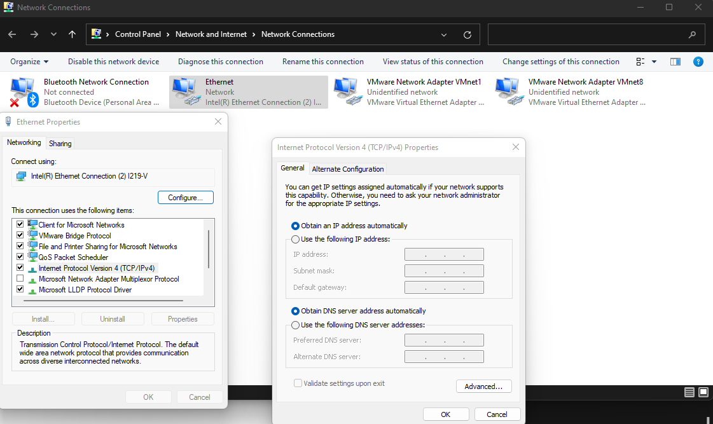

# Setting up Network Configuration

# Windows:

For commands:

1. Open up PowerShell as administrator
2. “`netsh interface ip show config`”
3. “`netsh interface ip set address name=”{}” static {IP} {subnet} {gateway}`”
    1. ^{} is the device you’re trying to configure
4. “`netsh interface ipv4 set dnsservers "{}" static {DNS} primary`” ← for primary DNS
    1. “`netsh interface ipv4 add dnsservers "{}" {altDNS} index=2`” ← alternate DNS
5. “`ipconfig`” ←check if changes worked

For GUI:

1. Go to Control Panel → Network and Internet → View Network status and tasks → change adapter settings
2. Right click on the adapter you want to configure and select “Properties”
3. Select “Internet Protocol Version 4 (TCP/IPv4)” and click on “Properties”
4. configure the device

# Linux:

For commands:

1. “`sudo ip link set {eth0} down`”
2. “`sudo ip addr add {IP}/{Subnet} via {gateway} dev {eth0}`”
    1. OR instead of “via {gateway}” : “`sudo ip route add default via {Gateway}`”
3. “`sudo ip link set {eth0} up`”

NOTE* set {eth0} to whatever device you’re trying to configure

For GUI:

sudo apt install network-manager

# MAC:

For Commands:

1. “`networksetup -listallnetworkservices`”
2. “`networksetup -getinfo "Ethernet"`”
    1. ^”Ethernet” can be replaced with whatever device name shows up from step 1
3. “`networksetup -setmanual "Ethernet" {IP} {Subnet} {Gateway}`"
4. OPTIONAL: “`networksetup -setdnsservers "Ethnernet" {DNS} {AlternateDNS}`”
5. “`networksetup -getinfo "Ethernet"`” ← check if everything worked

For GUI:

1. Go to System Preferences → Network
2. select the interface
3. Select “Manual” for Location and “Using DHCP with manual address” for Configure IPv4
4. Set IP and click “Advanced” → DNS → click + and add DNS
5. Go back and click apply

